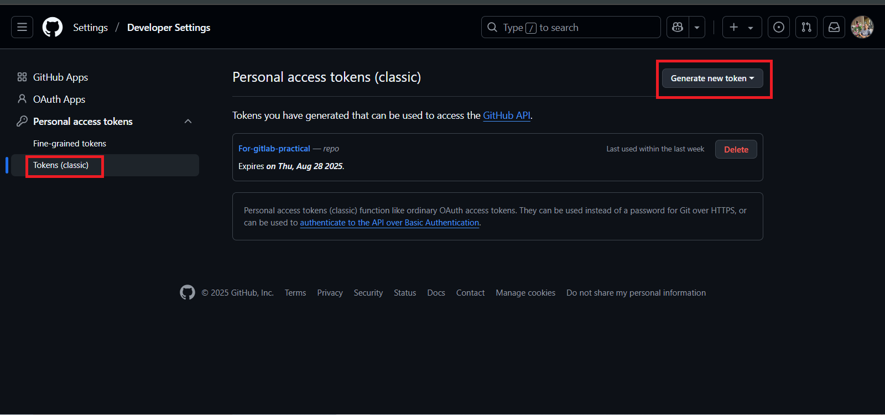

# 🚀 GitLab ↔ GitHub Repository Mirroring Project

This project demonstrates the complete setup of repository mirroring from **GitLab to GitHub**. It includes:
- Creating repositories on both platforms
- Generating GitHub personal access tokens
- Configuring GitLab repository mirroring settings
- Committing and pushing HTML files
- Ensuring changes in GitLab reflect automatically in GitHub
---

##  Features

-  GitLab to GitHub push-based mirroring
-  Secure authentication using GitHub personal access tokens
-  Git version control with branches and commits
-  Basic HTML structure pushed and synced
-  Professional README with documentation

---

##  Objective :

The purpose of this project is to:
- Show how to set up **continuous mirroring** between GitLab and GitHub
- Maintain a central workflow using GitLab while backing up or showcasing work on GitHub
- Demonstrate knowledge of authentication (token-based), version control, and Git operations

---
##  Prerequisites :

- Git installed on your system
- GitHub and GitLab accounts
- Basic knowledge of Git CLI

---
---
##  Project Description :
The goal of this project is to:
- Create and push basic HTML files to a GitLab repository.
- Set up **repository mirroring** from GitLab to GitHub.
- Ensure changes in GitLab are automatically pushed to GitHub using a **GitHub personal access token**.

---

##  Project Overview :

This repository contains:
- `index.html`


It also demonstrates:
- GitLab repository mirroring
- GitHub token usage
- Branching and merge request

---

##  Steps to Mirror GitHub Repo to GitLab 

### 1. Create Repositories
- GitHub: Create a repository (e.g., `mirror-repo`)


Give name to repository :


Initialize readmi.md file :


- GitLab: Create a project with the same name (`mirror-repo`)
Clik on create project


### 2. Generate GitHub Token
- Go to **GitHub > Settings > Developer settings > Personal access tokens**





- Create a token named: `mirror-repo-token`
- **Select all scopes**

### 3. Configure GitLab for Mirroring
- Go to your GitLab repo
- Navigate to:  
  **Settings > Repository > Mirroring Repositories**


- Add a new mirror:
  - **URL**: `https://github.com/your-username/mirror-repo.git`


  - **Username**: Your GitHub username
  - **Password**: The token you created


- Click on **Mirror repository**


### 4. Clone and Push Files

```
git clone <repo_url>
cd mirror-repo

# Create and push index.html
sudo vim index.html
git add .
git commit -m "Added index.html"
git push origin main

# Create and push contact.html
vim contact.html
git add .
git commit -m "Added contact.html"
git push origin main

```
## Final Output :


## Summary :
Repositories on both GitHub and GitLab are synced via GitLab's push mirroring.

Every commit pushed to GitLab is automatically mirrored to GitHub.

This setup helps in maintaining centralized control while leveraging GitHub visibility.
## Conclusion :
This project successfully demonstrates GitLab-to-GitHub repository mirroring using secure token-based authentication and a simple HTML project structure.
